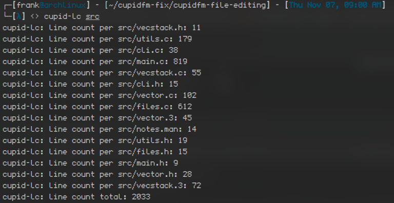

# cupid-lc

**cupid-lc** is a line count utility written in C for Unix and Linux systems. It calculates the total number of lines across files in a given directory or for a single file. The output includes both a cumulative total and individual line counts for each file processed. 

## Features

- Counts the total lines in a directory (including subdirectories) or a single file.
- Provides a line count for each file and a cumulative total.
- Recursive directory traversal for in-depth counting.
- Simple command-line interface, easy to integrate into scripts or workflows.

## Screenshot



## Example Usage

To use `cupid-lc`, simply pass a file or directory as an argument.

```bash
# Count lines in a directory
./cupid-lc src/

# Sample output:
# cupid-lc: line count per src/main.c : 73
# cupid-lc: line count total: 73
```

Or pass a single file:

```bash
./cupid-lc test.txt

# Sample output:
# cupid-lc: line count per test.txt: 3
# cupid-lc: line count total: 3
```

## Installation

To compile the program, clone the repository and use `gcc` to build the executable.

```bash
git clone https://github.com/username/cupid-lc.git
cd cupid-lc
gcc src/main.c -o cupid-lc
```

Replace `username` with your GitHub username.

## Usage

Run the compiled `cupid-lc` with the directory or file path as an argument:

```bash
./cupid-lc [directory_or_file]
```

### Command-Line Argument

- `[directory_or_file]`: The path to a directory or a file for which to calculate line counts.

## Output

The program will print the line count for each file, followed by a total line count. The format is as follows:

```plaintext
cupid-lc: line count per <filename>: <line_count>
cupid-lc: line count total: <total_line_count>
```

## Example Output

For a directory containing multiple files:

```plaintext
cupid-lc: line count per src/main.c : 301
cupid-lc: line count per src/count.c: 2000
cupid-lc: line count total: 2301
```

For a single file:

```plaintext
cupid-lc: line count per test.txt: 42
cupid-lc: line count total: 42
```

## License

This project is licensed under the GNU v3 License - see the [LICENSE](LICENSE) file for details.

---
